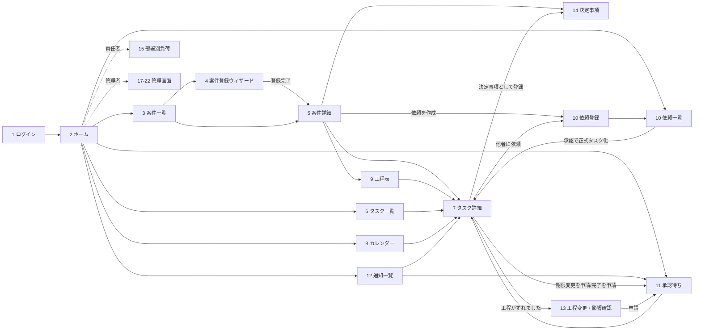
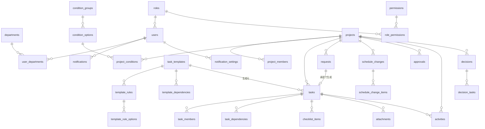
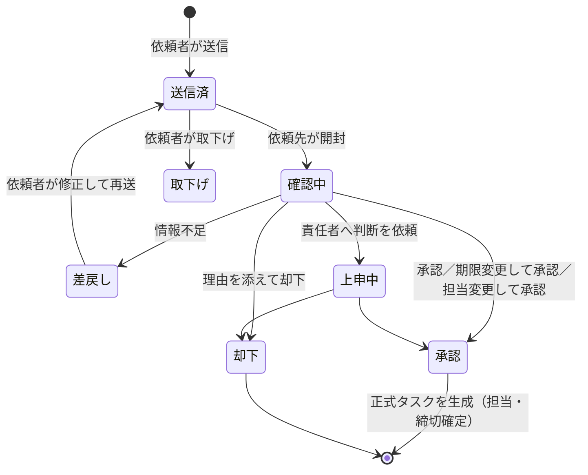
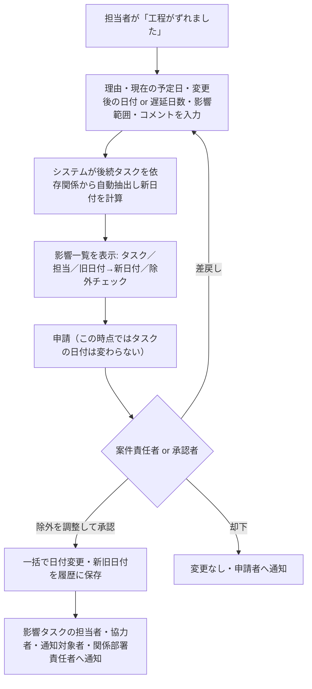

# 建設案件タスク管理アプリ 設計提案（第1版・実装前）

> 本書は要件定義の「AIへの依頼」に従い、**実装に入る前**に提示する設計案です。
> 独断で決めた点はすべて **【仮定】** と明記しています。
> 「2. 確認事項」への回答をいただいたのち、スマートフォン／PC両対応の試作画面を作成し、承認後に本実装へ進みます。

## 0. 確認事項への回答（第2版で反映）

| No | 回答 | 反映内容 |
|---|---|---|
| Q1・Q3 | さくらのレンタルサーバー、社内IDで可 | 【確定】PHP 8＋MySQL、メールアドレス＋パスワードの社内ID |
| Q13 | 既存の標準タスク一覧はない | 【確定】付録Aのサンプル（30件）を初期テンプレートとし、運用しながら管理画面で修正 |
| Q15 | 下書きでよい | 【確定】基準日が未定のタスクは「下書き（日付未確定）」で生成。基準日の入力で締切を自動計算し、確認後に「正式タスクにする」で未着手へ |
| Q19・Q21 | とりあえず所属長 | 【確定】部署宛ての依頼は所属長が受付。期限変更申請の承認者は担当部署の所属長 |
| Q25 | 後でよいが形だけ欲しい | 【確定】MVPはアプリ内通知＋メール。個人設定にプッシュ通知の設定欄と「通知の見え方を試す」を用意し、中身は第2段階 |
| その他 | 回答なし | 本書の推奨案（仮定）のまま試作。試作確認時に変更可 |

試作画面：`construction-tasks/prototype/`（使い方は同フォルダの README）

---

## 1. 要件の理解と前提条件

### 1.1 一言でいうと
営業・設計・工務・責任者が **同じ案件を見ながら**、
「案件登録 → 条件選択 → 標準タスク自動生成 → 担当・期限つきで進める → 依頼・承認・工程変更を記録つきで回す」
ための社内Webアプリ。チャットではなく **定型報告＋活動履歴** が中心。

### 1.2 要件から読み取った設計上の核
| # | 核となる考え方 | 設計への反映 |
|---|---|---|
| 1 | 閲覧は広く、変更は狭く | 閲覧は原則全員可。変更は「役割」×「担当関係（主担当・協力者・案件責任者・部署）」で判定 |
| 2 | 正式タスクには必ず担当者と締切 | 「下書き」以外の状態へ進めるには担当者・締切日が必須（DB制約＋画面チェック） |
| 3 | 他人に仕事を振るときは「依頼→承認→正式タスク」 | 依頼（request）とタスク（task）を別テーブルにし、承認時にタスクを生成 |
| 4 | システムは勝手に日付を動かさない | 工程変更は「影響の自動抽出 → 一覧で確認 → 承認 → 一括反映」の3段階 |
| 5 | 言った・言わないをなくす | すべての変更を活動履歴（不変ログ）に保存。「決定事項」は通常コメントと別管理 |
| 6 | 設定はコードに固定しない | 権限・案件条件・タスクテンプレート・生成ルール・通知タイミングはすべて管理画面で編集 |
| 7 | 現場・外出先から短時間で | スマホ最優先の画面設計。定型ボタン1〜2タップで報告完了 |

### 1.3 前提条件
- **【仮定】利用人数**：社員30〜100名程度、同時進行案件 50〜300件程度、1案件あたりタスク 30〜150件程度。
- **【仮定】利用環境**：社内PC（Chrome / Edge）、スマートフォン（iPhone Safari / Android Chrome）。専用アプリは作らず、**ブラウザで動くレスポンシブWebアプリ（PWA対応）** とする。
- **【仮定】技術構成**：既存の見学予約システムと同じ **さくらのレンタルサーバー（PHP 8 系）＋ MySQL** で動かせる構成を第一候補とする（社内の運用・契約を増やさないため）。
  - サーバー：PHP 8.x（フレームワークは軽量なもの or 既存コードと同じ素のPHP構成）
  - DB：MySQL 8（さくらのレンタルサーバー標準）
  - 画面：サーバー側HTML＋少量のJavaScript（スマホで軽く動くことを優先）
  - 定期処理：cron（締切通知・期限超過判定・メールまとめ送信）
  - メール：既存の Mailer と同様の SMTP 送信
  - ※ 規模が大きい／プッシュ通知必須／Microsoft 365 ログインを使う場合は、クラウド（例：AWS・Azure）構成も提案可能。確認事項 Q1 参照。
- **【仮定】ログイン**：メールアドレス＋パスワード（社内のみ）。二段階認証は管理者・役員のみ必須を推奨。
- **【仮定】営業日**：土日祝を休日とし、会社独自の休業日（盆・年末年始）を管理画面で登録できる。締切計算は「暦日」か「営業日」かをテンプレートごとに選べる。
- **【仮定】添付ファイル**：1ファイル20MBまで、図面PDF・写真・Excel等。保存先はサーバー内（容量に応じて将来クラウドストレージへ）。
- **【仮定】言語・時刻**：日本語のみ、日本時間（JST）。
- 要件定義書は「9.1 必要な画面」の 11 番（承認待ち一覧）以降が途切れていたため、12 番以降の画面は本書で補完している（3章参照）。**続きの要件があれば共有をお願いします。**

---

## 2. 不足している確認事項

各質問に **推奨案（そのまま進める場合の仮定）** を併記しています。
「推奨案でOK」と返答いただいた項目は、その内容で確定します。

### A. 基盤・運用
| No | 確認事項 | 推奨案（仮定） |
|---|---|---|
| Q1 | サーバー環境：既存のさくらレンタルサーバーで運用してよいか。社内サーバー／クラウドの指定はあるか | さくらレンタルサーバー＋MySQL |
| Q2 | 利用者数・案件数・1案件あたりタスク数の目安 | 1.3 の仮定値 |
| Q3 | ログイン方式：独自ID／Microsoft 365（Entra ID）／Google Workspace のどれか | 独自ID（メール＋パスワード）。将来 M365 連携可能な設計 |
| Q4 | 社外（協力業者・施主）にも使わせるか | MVPでは社内のみ |
| Q5 | 既存データ（Excel の案件台帳・工程表など）の取り込みは必要か | MVPでは案件の CSV 取込のみ |
| Q6 | 案件番号の採番ルール（例：`2026-0123`、種別記号つき等） | 年度＋連番の自動採番。手入力で上書き可 |

### B. 組織・権限
| No | 確認事項 | 推奨案（仮定） |
|---|---|---|
| Q7 | 部署一覧（営業・設計・工務・総務のほか、積算・経理・現場など） | 営業／設計／工務／積算／総務・経理／経営 |
| Q8 | 1人が複数部署・複数役割を兼務するケースはあるか | 兼務あり（主所属＋兼務部署） |
| Q9 | 「一般社員が手動タスク追加：条件付きで可」の条件 | 自分が関わる案件で、担当者が自分自身のタスクのみ直接追加可。他者を担当にする場合は依頼 |
| Q10 | 「自部署内で完結するタスク」は一般社員が同じ部署の他メンバーに直接割り当ててよいか | 一般社員は不可（依頼扱い）、部署責任者は可 |
| Q11 | 閲覧制限の対象となる情報の具体例と、見てよい人 | 原価・利益率・融資・個人情報・人事情報を「機密区分」とし、経営・案件責任者・該当部署責任者・個別に許可された人のみ閲覧 |
| Q12 | 「閲覧者」ロールは誰を想定しているか（パート・派遣・監査等） | 社員以外の閲覧専用アカウント |

### C. 案件・タスク生成
| No | 確認事項 | 推奨案（仮定） |
|---|---|---|
| Q13 | 現在使っている標準タスク（チェックリスト・工程表の雛形）はあるか。あれば初期データに流用したい | 提供いただいた資料を初期テンプレート化。なければ本書のサンプル約40件で開始 |
| Q14 | 住宅・施設・公共工事・小口工事で、項目や流れが大きく異なるか（小口工事は簡易登録にしたい等） | 小口工事は「簡易登録モード」（入力項目・タスクを最小限） |
| Q15 | 基準日が未定の自動生成タスクの扱い | 「下書き（日付未確定）」で生成し、基準日確定時に自動計算→担当者が確認して「未着手」へ |
| Q16 | 締切計算は暦日・営業日のどちらが標準か | テンプレートごとに選択（初期値：営業日） |
| Q17 | 自動生成タスクの主担当者は誰にするか | 案件登録時の営業／設計／工務担当者を、タスクの標準担当部署に応じて自動設定 |
| Q18 | 条件の組み合わせ（例：「土地なし かつ 土地購入」）で選択肢を出し分ける必要はあるか | 必要。条件間の表示依存（親条件）をマスタで設定可能にする |

### D. 依頼・承認・工程変更
| No | 確認事項 | 推奨案（仮定） |
|---|---|---|
| Q19 | 部署宛ての依頼は誰が受けるか（部署責任者のみ／部署員の誰でも） | 部署責任者＋部署が指定した「受付担当」 |
| Q20 | 依頼の返答期限（何日放置されたら督促・エスカレーションするか） | 2営業日で督促、3営業日で部署責任者へ通知 |
| Q21 | 期限変更申請の承認者 | 案件責任者（不在時は部署責任者） |
| Q22 | 完了申請（「完了を申請」）が必要なタスクと不要なタスクの区別 | テンプレートで「完了承認要否」を設定。承認者未設定なら担当者が直接完了可 |
| Q23 | 多段承認（例：部署責任者→役員）が必要な業務はあるか | MVPは1段承認＋「責任者へ判断を依頼（上申）」で対応。多段は拡張 |
| Q24 | 工程変更の承認者 | 案件責任者。影響タスクに他部署分が含まれる場合は当該部署責任者にも通知（承認は不要） |

### E. 通知・画面
| No | 確認事項 | 推奨案（仮定） |
|---|---|---|
| Q25 | プッシュ通知をMVPに含めるか（iPhone は「ホーム画面に追加」が必要） | MVPはアプリ内通知＋メール。Webプッシュは第2段階 |
| Q26 | メール通知の頻度 | 緊急・期限超過・承認依頼は即時、それ以外は1日2回（8:00／13:00）まとめ送信 |
| Q27 | Teams / LINE WORKS 等、社内で使っているチャットツール | 将来連携用に通知送信部分を差し替え可能な設計にしておく |
| Q28 | ガントチャートでの直接ドラッグ編集は必要か | MVPは閲覧のみ（日付変更はタスク詳細／工程変更フローから）。ドラッグ編集は拡張 |
| Q29 | 帳票・出力（工程表PDF・Excel出力）は必要か | MVPはCSV出力のみ |
| Q30 | 要件定義 9.1 の 12 番以降（途切れた部分）の内容 | 3章で補完した画面で仮置き |

---

## 3. 画面一覧と画面遷移

### 3.1 画面一覧
S=スマホ最適化の度合い（◎：スマホ主利用、○：両方、△：PC主利用）

| No | 画面 | 主な内容 | S |
|---|---|---|---|
| 1 | ログイン | ID・パスワード、パスワード再設定 | ◎ |
| 2 | ホーム・ダッシュボード | 今日／今週の自分のタスク、期限超過、承認待ち件数、届いた依頼、未読通知、（責任者向け）部署別負荷 | ◎ |
| 3 | 案件一覧 | 検索・絞込（種別・担当・状態・遅延あり）、進捗率、遅延件数 | ○ |
| 4 | 案件登録ウィザード | ①基本情報 → ②案件条件 → ③生成予定タスク確認・除外 → ④担当・日付の確認 → 登録 | ○ |
| 5 | 案件詳細 | タブ：概要／タスク／工程表／活動履歴／決定事項／添付／（機密）原価情報 | ○ |
| 6 | タスク一覧 | 表示切替：今日・今週・担当者別・部署別・案件別・締切超過・承認待ち・依頼中 | ○ |
| 7 | タスク詳細・編集 | 項目表示、定型報告ボタン、チェックリスト、コメント、履歴、前後工程 | ◎ |
| 8 | カレンダー | 月／週表示、自分・部署・案件で絞込 | ○ |
| 9 | 工程表・ガントチャート | 案件単位の工程表、前後関係の線、遅延表示 | △ |
| 10 | 依頼一覧・依頼登録 | 送った依頼／届いた依頼、依頼フォーム、回答操作 | ◎ |
| 11 | 承認待ち一覧 | 依頼・期限変更・完了申請・工程変更をまとめて承認／差戻し | ◎ |
| 12 | 【補完】通知一覧 | 重要（緊急・期限超過・承認待ち）と通常を分けて表示、一括既読 | ◎ |
| 13 | 【補完】工程変更申請・影響確認 | 変更入力 → 影響タスク一覧（新旧日付、除外チェック）→ 申請／承認 | ○ |
| 14 | 【補完】決定事項一覧 | 案件横断で決定事項を検索 | ○ |
| 15 | 【補完】部署別負荷（責任者向け） | 部署・担当者ごとの件数／遅延数／今後2週間の締切数 | △ |
| 16 | 【補完】個人設定 | 通知タイミング・メール受信設定・パスワード変更 | ◎ |
| 17 | 【補完】管理：ユーザー・部署 | ユーザー登録・所属・役割・有効/無効 | △ |
| 18 | 【補完】管理：権限設定 | 役割×操作のマトリクスをチェックボックスで編集 | △ |
| 19 | 【補完】管理：案件条件マスタ | 条件グループ・選択肢の追加・編集・並べ替え・無効化 | △ |
| 20 | 【補完】管理：タスクテンプレート・生成ルール | 標準タスク、担当部署、所要日数、基準日、前後関係、承認者、生成条件、テスト生成 | △ |
| 21 | 【補完】管理：通知設定・休日カレンダー | 締切通知の既定タイミング、会社休日 | △ |
| 22 | 【補完】管理：操作ログ | 誰がいつ何を変更したかの検索 | △ |

### 3.2 画面遷移



### 3.3 スマホとPCの画面構成
- **スマホ**：下部タブ「ホーム／タスク／依頼・承認／通知／メニュー」。一覧はカード表示、タスク詳細の下部に定型ボタンを固定。
- **PC**：左サイドメニュー＋一覧は表形式（列の並べ替え・絞込）。案件詳細は左に概要、右にタスク・履歴の2カラム。
- 一覧の必須表示項目：**案件名／タスク名／担当者／締切日／状態／遅延バッジ**（要件 4.3）。

---

## 4. 権限表

### 4.1 権限判定の考え方（2層）
1. **役割権限（ロール）**：管理画面の「役割 × 操作」マトリクスで ON/OFF（DB 保存、コード固定しない）。
2. **関係による権限**：対象データとの関係で上乗せ。
   - タスクの **主担当者・協力者** → そのタスクの状況更新・報告・コメント・チェックリスト・添付
   - **案件責任者** → その案件内の全タスクの担当者・期限・承認者変更、承認
   - **部署責任者** → 自部署が担当部署のタスクの担当者変更・期限変更・承認
   - **承認者に指定された人** → そのタスク・申請の承認
3. **機密区分**：案件・項目・添付・コメントに「公開範囲」を設定。機密区分を見られるのは権限「機密閲覧」を持つ人または個別に許可された人のみ。

判定式：`許可 = 役割権限で許可 AND (関係条件を満たす OR 役割が「全案件対象」)` かつ `公開範囲を満たす`

### 4.2 初期権限表（管理画面で変更可能）
凡例：◎＝全案件で可／○＝関係がある範囲で可／△＝申請のみ／×＝不可

| 操作 | 一般社員 | 案件責任者 | 部署責任者 | 経営者・役員 | 閲覧者 | システム管理者 |
|---|:-:|:-:|:-:|:-:|:-:|:-:|
| 案件・タスク閲覧（通常範囲） | ◎ | ◎ | ◎ | ◎ | ◎ | ◎ |
| 機密情報の閲覧（原価・利益率等） | × | ○(担当案件) | ○(自部署関連) | ◎ | × | ◎ ※1 |
| 案件登録 | ○(営業のみ)【仮定】 | ◎ | ◎ | ◎ | × | ◎ |
| 案件基本情報の編集 | ○(担当者として登録された案件) | ○(自案件) | ○ | ◎ | × | ◎ |
| 自分のタスクの状況更新・報告 | ○ | ○ | ○ | ○ | × | ◎ |
| 手動タスク追加（担当=自分） | ○(関わる案件) | ○ | ○ | ◎ | × | ◎ |
| 手動タスク追加（担当=他者） | △(依頼として送信) | ○(自案件) | ○(自部署員) | ◎ | × | ◎ |
| 他者・他部署への依頼 | ○ | ○ | ○ | ○ | × | ○ |
| 期限変更 | △ | ○(自案件) | ○(自部署タスク) | ◎ | × | ◎ |
| 担当者・承認者の変更 | × | ○(自案件) | ○(自部署タスク) | ◎ | × | ◎ |
| 承認（依頼・期限変更・完了・工程変更） | × ※2 | ○(自案件) | ○(自部署) | ◎ | × | ◎ |
| 決定事項の登録 | ○(関わる案件) | ○ | ○ | ◎ | × | ◎ |
| タスク取消 | × | ○(自案件) | ○(自部署タスク) | ◎ | × | ◎ |
| 案件条件・テンプレートの編集 | × | × | △(自部署のテンプレートのみ)【仮定】 | ○(必要に応じ付与) | × | ◎ |
| ユーザー・権限設定 | × | × | × | ○(必要に応じ付与) | × | ◎ |
| 操作ログ閲覧 | × | ○(自案件) | ○(自部署) | ◎ | × | ◎ |

※1 システム管理者の機密閲覧は、運用上外すことも可能（管理画面で OFF）。
※2 一般社員でも、タスクの「承認者」に個別指定された場合はそのタスクのみ承認可。
「案件責任者」は役職ではなく **案件ごとに付く関係** として扱う（同じ人が別案件では一般社員として振る舞う）。

---

## 5. データベース設計

### 5.1 ER 図（主要テーブル）



### 5.2 テーブル定義（主要項目）

#### 組織・権限
| テーブル | 主な列 | 備考 |
|---|---|---|
| `users` | id, name, email, password_hash, role_id, is_active, is_viewer, last_login_at | 退職者は無効化（削除しない） |
| `departments` | id, name, sort_order, is_active | |
| `user_departments` | user_id, department_id, is_primary, is_manager, is_receiver | 兼務・部署責任者・依頼受付担当 |
| `roles` | id, code, name | 一般／部署責任者／経営／閲覧者／管理者 |
| `permissions` | id, code, name, category | 例：`task.create.others`, `confidential.view` |
| `role_permissions` | role_id, permission_id, scope | scope: `none/related/department/all` |
| `confidential_grants` | project_id, user_id | 機密情報の個別閲覧許可 |

#### 案件
| テーブル | 主な列 | 備考 |
|---|---|---|
| `projects` | id, project_no, name, customer_name, project_type_option_id, address, manager_user_id, contract_planned_date, contract_date, start_planned_date, completion_planned_date, handover_planned_date, visibility, status, note, is_simple_mode, created_by/at, updated_by/at | 日付列は「予定」と「実績」を分けて保持 |
| `project_members` | project_id, user_id, role_in_project | `sales/design/construction/manager/other` |
| `project_confidential` | project_id, cost, profit_rate, loan_info, … | 機密項目を **別テーブル** に分離し、権限がないと取得自体しない |
| `condition_groups` | id, name, selection_type(single/multi), parent_option_id, sort_order, is_active | 例：「土地」「工事種別」。parent_option_id で表示依存 |
| `condition_options` | id, group_id, label, sort_order, is_active | 例：「土地あり」「土地なし」 |
| `project_conditions` | project_id, option_id | 案件で選ばれた条件 |

#### タスクテンプレート・生成ルール
| テーブル | 主な列 | 備考 |
|---|---|---|
| `task_templates` | id, code, name, category, default_department_id, default_assignee_rule, duration_days, base_type, base_template_id, offset_days, day_type(calendar/business), default_approver_rule, requires_completion_approval, checklist_json, description, sort_order, is_active, version | 6章参照 |
| `template_rules` | id, template_id, rule_no | 1テンプレートに複数ルール（OR） |
| `template_rule_options` | rule_id, option_id, match(include/exclude) | 1ルール内は AND |
| `template_dependencies` | template_id, predecessor_template_id, lag_days | 標準の前後関係 |

#### タスク
| テーブル | 主な列 | 備考 |
|---|---|---|
| `tasks` | id, project_id, template_id(null=手動), origin(`auto/manual/request`), name, category, department_id, owner_user_id, approver_user_id, start_planned_date, due_date, due_date_status(`fixed/pending_base/manual`), completed_at, priority, status, description, visibility, source_request_id, created_by/at, updated_by/at, lock_version | 状態＝下書き/未着手/進行中/確認待ち/回答待ち/承認待ち/保留/完了/取消 |
| `task_members` | task_id, user_id, member_type(`collaborator/watcher`) | 協力者・通知対象者 |
| `task_dependencies` | task_id, predecessor_task_id, lag_days | 前工程・後工程 |
| `checklist_items` | id, task_id, text, is_done, done_by, done_at, sort_order | |
| `attachments` | id, project_id, task_id, request_id, file_name, stored_path, size, mime, visibility, uploaded_by/at | |

※「期限超過」「工程遅延」は **列として保存せず** 締切日・状態・前工程から都度判定（表示用に夜間バッチで `task_alerts` にキャッシュ）。

#### 依頼・承認・工程変更
| テーブル | 主な列 | 備考 |
|---|---|---|
| `requests` | id, project_id, from_user_id, to_department_id, to_user_id, title, content, reason, desired_due_date, urgency, status(`sent/in_review/approved/returned/rejected/escalated/withdrawn`), decided_by, decided_at, decided_due_date, decided_assignee_id, decision_comment, created_task_id | |
| `approvals` | id, project_id, target_type(`request/due_change/completion/schedule_change`), target_id, requested_by, approver_user_id, status(`pending/approved/returned/rejected`), comment, decided_at | 承認待ち一覧の元データ |
| `due_change_requests` | id, task_id, old_due_date, new_due_date, reason, status | 期限変更申請 |
| `schedule_changes` | id, project_id, origin_task_id, reason, old_date, new_date, delay_days, impact_note, comment, status(`draft/pending/approved/rejected/applied`), requested_by, approved_by, applied_at | 工程変更申請 |
| `schedule_change_items` | schedule_change_id, task_id, old_start, new_start, old_due, new_due, is_excluded | 影響タスクと新旧日付 |

#### 履歴・コミュニケーション
| テーブル | 主な列 | 備考 |
|---|---|---|
| `activities` | id, project_id, task_id, actor_user_id, type, payload_json, comment, visibility, created_at | **追記のみ（更新・削除不可）**。type 例：`task.created`, `report.started`, `due.changed`, `request.approved`, `comment` |
| `field_changes` | activity_id, field, old_value, new_value | 変更前後の値（担当者・締切日など） |
| `decisions` | id, project_id, content, decided_by_user_id, decided_on, source_activity_id, created_by/at | 決定事項 |
| `decision_tasks` | decision_id, task_id | 影響するタスク |
| `quick_actions` | id, code, label, requires_comment, requires_date, requires_reason, next_status, sort_order, is_active | 定型ボタンもマスタ化 |

#### 通知
| テーブル | 主な列 | 備考 |
|---|---|---|
| `notifications` | id, user_id, event_type, level(`normal/important/urgent`), project_id, task_id, title, body, link, is_read, emailed_at, created_at | |
| `notification_rules` | id, event_type, offset_days, level, target(`owner/owner+manager/…`), is_active | 締切7/3/1/0日前・超過などの既定値 |
| `notification_settings` | user_id, event_type, channel_app, channel_email, digest | 個人設定 |
| `holidays` | date, name | 営業日計算用 |

### 5.3 設計上の注意点
- **同時編集対策**：`tasks.lock_version` で楽観ロック（スマホとPCで同時に更新しても上書き事故を防ぐ）。
- **論理削除**：タスクは「取消」状態、ユーザーは無効化。物理削除はしない（履歴の整合性維持）。
- **テンプレートの版管理**：`task_templates.version` を持ち、既存案件のタスクはテンプレート変更の影響を受けない。

---

## 6. タスク自動生成ルールの設計方法

### 6.1 生成条件の表現
各テンプレートに「どの条件のとき生成するか」を **ルール（ORの集まり）× 条件（ANDの集まり）** で持たせる。

```
テンプレート「確認申請書類作成」
  ルール1: [確認申請あり]
テンプレート「地盤改良工法の決定」
  ルール1: [地盤調査あり] AND [地盤改良あり]
  ルール2: [地盤調査あり] AND [地盤改良未定]
テンプレート「住宅ローン事前審査」
  ルール1: [住宅] AND [住宅ローン] AND NOT [小口工事]
テンプレート「着工前打ち合わせ」
  ルール: なし（＝全案件で生成）
```

- 管理画面では「条件を選んで追加」する形で編集（式を書かせない）。
- 管理画面に **「テスト生成」** 機能：条件を選ぶと生成されるタスク一覧をその場で確認できる。

### 6.2 生成手順
1. 案件で選ばれた条件の集合 `S` を取得。
2. 有効な全テンプレートについて、いずれかのルールが `S` で成立するか判定。
3. 成立したテンプレートを **テンプレートID単位で1件にまとめる**（複数ルール・複数条件に該当しても重複しない）。
   - 異なるテンプレートでも「同一タスク扱い」にしたいものは `code` を同じにして統合（例：セルコホーム用と通常用の「仕様打ち合わせ」）。優先度の高いテンプレートを採用。
4. テンプレートの前後関係から、生成されなかったテンプレートを飛ばして依存を張り直す（A→B→C で B が除外されたら A→C）。
5. 締切日を計算（6.3）。
6. **生成予定一覧を表示** → 権限者がチェックを外して除外、担当者・日付を必要に応じ調整。
7. 確定で一括登録し、活動履歴に「自動生成（テンプレート版・除外したタスクと理由）」を記録。

### 6.3 締切日の自動計算
各テンプレートに以下を設定する。

| 項目 | 選択肢 | 例 |
|---|---|---|
| 基準日 (`base_type`) | 契約日／着工日／完成日／引渡日／前工程の完了日／前工程の締切日／案件登録日 | 着工日 |
| 前後 (`offset_days`) | マイナス＝前、プラス＝後 | −30 |
| 日数の数え方 (`day_type`) | 暦日／営業日 | 営業日 |
| 所要日数 (`duration_days`) | 開始予定日＝締切日−所要日数 | 5 |

要件の例をこの形式で書くと：

| タスク | 基準日 | 日数 |
|---|---|---|
| 見積もり確定 | 契約日 | −7 |
| 確認申請 | 着工日 | −30 |
| 地盤改良方法の決定 | 前工程「地盤調査」の完了日 | +5 |
| 議事録作成 | 前工程「打ち合わせ」の完了日 | +3 |

- 基準日の優先順：**実績日 → 予定日**（契約日が入っていれば契約日、なければ契約予定日）。
- 基準日が未定 → `due_date = NULL`, `due_date_status = pending_base`、画面に **「日付未確定」** と表示。状態は「下書き」のまま。
- 案件の基準日が入力・変更されたとき、`pending_base` のタスクを自動計算。**すでに確定済みのタスクは自動では動かさず**、7章の工程変更フローで影響一覧を提示する。
- 前工程完了日基準のタスクは、前工程が完了した時点で締切を確定し、担当者へ「開始できます」通知。
  ただし前工程の締切日から暫定締切（「見込み」表示）を出して、工程表上で見えるようにする。
- 「下書き」→「未着手」へ進めるには締切日と主担当者が必須（要件の「正式運用前に必ず締切確定」を担保）。

### 6.4 担当者の自動設定
`default_assignee_rule` の例：「案件の営業担当」「案件の設計担当」「案件の工務担当」「案件責任者」「部署の受付担当」「指定ユーザー」。
担当者が決まらない場合は「担当未設定」として生成予定一覧で赤く表示し、登録前に設定を促す。

---

## 7. 通知・承認フロー

### 7.1 依頼 → 正式タスク



- 各遷移で `activities` に記録、依頼者と関係者へ通知。
- 「期限変更して承認」の場合、依頼者に「期限が変更されました（希望：9/30 → 承認：10/7）」と明示。
- 未処理の依頼は Q20 の日数で督促・エスカレーション。

### 7.2 期限変更申請・完了申請
- 一般社員の「期限変更を申請」→ 承認者（案件責任者）に承認依頼 → 承認で締切日更新。後続タスクに影響がある場合は、承認画面に影響一覧を表示し、そのまま工程変更フロー（7.3）として処理できる。
- 「完了を申請」→ 承認者が承認で「完了」、差戻しで「進行中」に戻る。

### 7.3 工程変更



- 影響の計算：変更タスクの新締切から、`task_dependencies`（前工程→後工程＋lag_days）をたどって後続タスクを **必要な分だけ** 後ろ倒し（前倒しは自動提案しない【仮定】）。
- 完了済み・取消タスクは対象外。
- 案件の完成予定日・引渡予定日を超える場合は赤で警告。

### 7.4 通知
| 出来事 | 受け取る人 | 重要度 |
|---|---|---|
| タスクが割り当てられた | 主担当・協力者 | 通常 |
| 依頼が届いた | 依頼先（個人 or 部署受付担当＋部署責任者） | 重要 |
| 依頼が承認・差戻し・却下された | 依頼者 | 通常（差戻し・却下は重要） |
| 承認依頼が届いた | 承認者 | 重要 |
| 担当者・期限が変更された | 旧担当・新担当・協力者 | 通常 |
| 工程変更が申請・承認された | 承認者／影響タスクの担当者・関係部署責任者 | 重要 |
| コメント・確認依頼が付いた | 主担当・協力者・通知対象者 | 通常（確認依頼は重要） |
| 前工程が完了し開始可能になった | 後続タスクの主担当 | 通常 |
| 締切7日前・3日前 | 主担当 | 通常 |
| 締切前日・当日 | 主担当 | 重要 |
| 締切超過 | 主担当＋案件責任者（＋部署責任者【仮定】） | 緊急 |

- **通知過多対策**：通常通知はアプリ内で案件ごとにまとめ表示、メールは1日2回のまとめ送信。緊急・重要のみ即時メール＋画面上部に赤バッジ。
- 自分が行った操作は自分には通知しない。
- 締切通知は毎朝のcronで判定（二重送信防止のため送信済みを記録）。
- **送信経路は差し替え可能に**：通知生成（何を誰に）と配信（アプリ内・メール・将来のWebプッシュ・Teams）を分離した設計にする。

---

## 8. MVPの開発範囲とその後の拡張案

### 8.1 MVP（第1段階）
| 区分 | 含める機能 |
|---|---|
| 基盤 | ログイン、ユーザー・部署・役割管理、権限マトリクス（管理画面から編集）、操作ログ |
| 案件 | 案件一覧・検索、案件登録ウィザード（条件選択 → 生成予定確認・除外 → 登録）、案件詳細、機密情報の閲覧制限 |
| マスタ | 案件条件マスタ、タスクテンプレート・生成ルール・前後関係、テスト生成、休日カレンダー、定型ボタン |
| タスク | 自動生成・手動追加、締切自動計算（日付未確定対応）、状態管理、チェックリスト、添付、協力者・通知対象者、各種一覧（今日・今週・担当者別・部署別・案件別・締切超過・承認待ち・依頼中）、遅延・期限超過の自動判定表示 |
| 報告 | 定型ボタン10種、コメント、活動履歴、決定事項登録 |
| 依頼・承認 | 依頼登録・6種の回答操作、期限変更申請、完了申請、承認待ち一覧 |
| 工程変更 | 影響抽出・一覧・除外・承認後一括反映・新旧履歴 |
| 表示 | カレンダー（月・週）、工程表（閲覧のみのガント） |
| 通知 | アプリ内通知、メール通知（即時＋まとめ）、締切通知（設定変更可） |
| 端末 | スマホ・PC両対応のレスポンシブ画面、ホーム画面追加（PWA） |

### 8.2 開発の進め方
1. **確認事項への回答**（本書）
2. **試作画面**（クリックで動くHTMLモック・スマホ/PC両対応。ダミーデータで案件登録〜タスク生成〜依頼〜工程変更まで体験できるもの。既存の見学予約システムと同様にGitHub Pagesで社内に回覧可能）
3. 試作への承認
4. 本実装（DB → 権限・マスタ → 案件・タスク生成 → 依頼・承認 → 工程変更 → 通知 → 表示系の順）
5. 社内テスト運用（1〜2部署・数案件）→ 全社展開

### 8.3 拡張案（第2段階以降）
| 優先 | 拡張 | 内容 |
|---|---|---|
| 高 | Webプッシュ通知 | PWAによるスマホ通知（iPhoneはホーム画面追加が条件） |
| 高 | ガントのドラッグ編集 | 工程表上で日付を動かす → 自動的に工程変更申請になる |
| 高 | 部署別負荷ダッシュボード強化 | 担当者ごとの今後の締切件数のヒートマップ、偏りの可視化 |
| 中 | Teams / LINE WORKS 連携 | 重要通知の転送、日次サマリー投稿 |
| 中 | Microsoft 365 / Google ログイン | シングルサインオン |
| 中 | 多段承認 | 金額や種別に応じた承認ルート |
| 中 | 帳票出力 | 工程表PDF・Excel、案件サマリー |
| 中 | 写真の現場報告 | スマホで撮影→タスクに添付、位置情報つき |
| 低 | 協力業者・施主ポータル | 社外向けの限定公開画面 |
| 低 | 既存Excel台帳の一括移行 | 案件・工程表の取り込みツール |
| 低 | 分析 | テンプレートごとの実績所要日数から標準日数を見直す提案 |

---

## 付録A：初期テンプレートのサンプル（Q13 の回答がない場合の仮置き）
| 分類 | タスク | 担当部署 | 基準日 | 日数 | 生成条件 |
|---|---|---|---|---|---|
| 営業 | 初回ヒアリング記録 | 営業 | 案件登録日 | +3 | 全案件 |
| 営業 | 土地情報の取得・調査 | 営業 | 案件登録日 | +14 | 土地あり |
| 営業 | 土地探し・候補提示 | 営業 | 案件登録日 | +30 | 土地なし |
| 営業 | 土地売買契約 | 営業 | 契約日 | −14 | 土地購入 |
| 営業 | 借地契約の確認 | 営業 | 契約日 | −14 | 借地 |
| 営業 | 住宅ローン事前審査 | 営業 | 契約日 | −21 | 住宅ローン |
| 営業 | 住宅ローン本申込 | 営業 | 契約日 | +14 | 住宅ローン |
| 営業 | 補助金の要件確認 | 営業 | 契約日 | −14 | 補助金あり |
| 営業 | 見積もり確定 | 営業 | 契約日 | −7 | 全案件 |
| 営業 | 工事請負契約 | 営業 | 契約日 | 0 | 全案件 |
| 設計 | 地盤調査の手配 | 設計 | 契約日 | +7 | 地盤調査あり |
| 設計 | 地盤改良方法の決定 | 設計 | 前工程「地盤調査」完了 | +5 | 地盤調査あり AND 地盤改良あり/未定 |
| 設計 | 実施設計 | 設計 | 着工日 | −45 | 新築 |
| 設計 | 長期優良住宅 認定申請 | 設計 | 着工日 | −35 | 長期優良住宅 対象 |
| 設計 | 確認申請 | 設計 | 着工日 | −30 | 確認申請あり |
| 設計 | CLT 構造検討 | 設計 | 着工日 | −60 | CLT案件 |
| 設計 | セルコホーム 仕様確定 | 設計 | 着工日 | −40 | セルコホーム案件 |
| 工務 | 解体工事の手配 | 工務 | 着工日 | −21 | 解体工事あり |
| 工務 | 造成工事の手配 | 工務 | 着工日 | −21 | 造成工事あり |
| 工務 | 近隣挨拶 | 工務 | 着工日 | −7 | 住宅・施設 |
| 工務 | 着工前打ち合わせ | 工務 | 着工日 | −10 | 全案件 |
| 工務 | 打ち合わせ議事録作成 | 工務 | 前工程「打ち合わせ」完了 | +3 | 全案件 |
| 工務 | 中間検査 | 工務 | 着工日 | +45 | 確認申請あり AND 新築 |
| 工務 | 完了検査 | 工務 | 完成日 | 0 | 確認申請あり |
| 工務 | 社内竣工検査 | 工務 | 完成日 | −5 | 全案件 |
| 工務 | 引渡書類準備 | 工務 | 引渡日 | −7 | 全案件 |
| 営業 | 補助金 実績報告 | 営業 | 引渡日 | +14 | 補助金あり |
| 工務 | 小口工事 手配・完了報告 | 工務 | 案件登録日 | +14 | 小口工事 |

※ 日数・担当部署はすべて仮置きです。実際の社内ルールに合わせて差し替えます。
